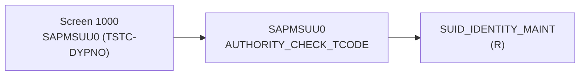

## What I do

시스템명 + 티코드를 받아, 티코드와 동일한 프로그램을 파이썬으로 만들기 위한
메뉴얼(분석서)을 작성한다. 소스 탐색은 `erpl-adt` MCP 서버의 `adt_*` 도구로만 수행한다.
산출물 `docs/analysis/<SYSTEM>_<TCODE>.md`의 핵심은 두 가지다:

1. 티코드에서 가능한 기능들 (function catalog)
2. 각 기능 호출 시 받는 인자 (args spec)

이 문서가 `sap-tcode-to-python` 스킬과, 외부에서 MCP로 티코드를 재사용할 때의 계약이 된다.

## When to use me

- "DEV / VA01 분석해줘", "MIGO 뜯어서 메뉴얼 만들어줘" 요청 시 (분석 스킬이 먼저)
- 파이썬 구현 전에 반드시 실행 (분석서 없이 코드 생성 금지)
- 실제 소스(MCP + RFC) 기반 확인이 필요할 때

## Inputs

1. `system`: `sap_systems.json`의 `name` 또는 `sid` (예: `DEV`, `A4H`). 없으면 질문.
2. `tcode`: 티코드 1개 (대문자, 예: `VA01`). 여러 개면 하나씩 반복.

## Prerequisite: erpl-adt MCP 연결 확인

본 스킬은 CLI가 아니라 MCP 도구(`adt_*`)로 탐색한다.
`opencode.json`에 `erpl-adt` MCP가 등록되어 있어야 한다 (command: `erpl-adt mcp --tools adt`).

1. 먼저 `adt_discover`를 호출해 SAP 연결이 살아 있는지 확인한다.
2. 실패하면 사용자에게 접속정보를 요청한다:
   - 로컬 trial(a4h): host `127.0.0.1`, port `50000`, user `DEVELOPER`, client `001`
   - 실시스템: `sap_systems.json`의 ashost/port/user/client + `SAP_PASSWORD` env
   - 자격증명 우선순위: flags > `--password-env` > env(`SAP_HOST/SAP_PORT/SAP_USER/SAP_PASSWORD/SAP_CLIENT`) > `erpl-adt login` 저장값
   - MCP는 opencode 시작 시점에 접속先이 고정되므로, 시스템 변경 시 env 수정 후 opencode 재시작이 필요함을 안내한다.
3. 연결 없이 추측으로 분석서를 쓰지 않는다.

## Analysis workflow (MCP 도구 지정, 순서 엄수)

### 0. TCODE → 프로그램 매핑 (RFC, MCP에 없는 영역)

ADT에는 TCODE→프로그램 조회 도구가 없으므로, 실존 테이블 `TSTC`/`TSTCT`를 RFC로 조회한다
(`sap_monthly_report.rfc_read_table` 재사용, OPTIONS 72자 제한은 래퍼가 처리):

```python
from sap_monthly_report import get_connection_by_name, rfc_read_table
conn = get_connection_by_name("DEV")  # system 인자 사용
print(rfc_read_table(conn, "TSTC", ["TCODE","PGMNA"], where="TCODE = 'VA01'"))
print(rfc_read_table(conn, "TSTCT", ["TCODE","TTEXT"], where="TCODE = 'VA01'"))
```

- `TSTC-PGMNA`가 프로그램명. 없으면 SE93 커스텀/파라미터 트랜잭션 가능성으로 보고.
- 비밀번호 반복 재시도 금지 (`get_connection_by_name`의 auth_failed 차단 존중).

### 1. 프로그램 구조 파악 (MCP)

- `adt_search` — `<PGMNA 앞부분>*` 패턴 + 관련 `FUGR`/`CLAS` 후보 탐색 (예: `V45A*`, `ZSD*`)
- `adt_read_object` — 프로그램/클래스의 메타데이터(URI, include 목록, source URI) 확인
- `adt_list_package` / `adt_package_tree` — 소속 패키지 기준 연관 객체 enumeration

### 2. 소스 정독 (MCP)

- `adt_read_source` — 본 프로그램 + `adt_read_object`에서 나온 모든 include/top에 대해 반복 읽기
  (`--section` 개념: main / localdefinitions / localimplementations / testclasses, 필요시 all)
- 발췌 대상 (전부 원문 인용 + 소스 위치 기록):
  - `SELECTION-SCREEN / PARAMETERS / SELECT-OPTIONS` → 기능 인자 후보
  - PBO/PAI 모듈, `CALL SCREEN`, `CALL TRANSACTION`, `SUBMIT`
  - `CALL FUNCTION 'XXX'` 전수 → FM/BAPI 후보
  - `SELECT/INSERT/UPDATE/DELETE FROM <table>` 전수 → 테이블 CRUD 후보
  - `AUTHORITY-CHECK OBJECT '<obj>'` 전수 → 권한 목록
- dynpro 기반이면 화면 필드도 인자 후보에 포함하고, GUI 전용(`CALL SCREEN` 중단 로직)은 "RFC 재현 불가"로 분류.

### 3. FM/BAPI 상세 (MCP)

- 소스에서 추출한 FM마다 `adt_read_source` (type FUGR) + `adt_read_object`로 시그니처(IMPORTING/EXPORTING/TABLES/EXCEPTIONS) 확정
- Remote-enabled 여부는 소스 속성 + 필요시 RFC `TFDIR(FMODE=R)` 교차확인

### 4. 테이블/DDIC 확정 (MCP + RFC 교차확인)

- `adt_read_table <TABL>` — 필드, 키, 체크테이블, ABAP 타입 확인
- `adt_read_cds <CDS>` — CDS 경유 로직이면 DDL 원문 확보
- RFC `DDIF_FIELDINFO_GET` (`sap_monthly_report.table_fields`) 로 필드 실존 2차 확인
- 없는 테이블/FM/필드는 절대 기재하지 않고 "미확인"으로 남긴다

### 5. 기능·인자 확정 (본 스킬의 핵심 산출)

소스 근거를 기능 단위로 묶고, 각 기능마다 호출 인자를 확정한다.
인자는 SELECTION-SCREEN / FM 시그니처 / dynpro 필드에서만 도출하며, 추측 인자 생성 금지.

## Output: 분석서 포맷 (고정, `docs/analysis/<SYSTEM>_<TCODE>.md`)

```markdown
# <TCODE> 분석 (<SYSTEM>)
- 분석일 / 대상 시스템(name/SID) / 티코드 + 내역(`TSTCT-TTEXT`)
- 프로그램(`TSTC-PGMNA`) / 패키지 (`adt_read_object` 결과)

## 1. 실행 경로 요약 (5줄 이내)

## 2. 기능 카탈로그 (티코드에서 가능한 기능들) ← 핵심
| 기능ID | 기능명 | 원천 (프로그램/FM) | RFC 재현 | 비고 |
|---|---|---|---|---|
| F01 | 단건 조회 | ... | 가능(BAPI_...) | |
| F02 | 생성 | ... | 가능/불가 + 사유 | |

## 2.5 화면요소-소스-펑션 연계도 (mermaid, 필수)
화면(dynpro/스크린번호) → 소스(include/모듈·메서드) → 펑션(FM/BAPI) → 테이블 흐름을
mermaid flowchart로 그린다. 노드 ID 규칙: `S<스크린>` / `SRC<인클루드_모듈>` / `F<FM명>` / `T<테이블>`.

- 스크린번호는 `TSTC-DYPNO` + PBO/PAI 모듈 주석에서 실측한 것만 사용. dynpro 필드明细(RFC D020S/D021S 등)가 안 나오면 화면 노드는 스크린 단위로만 표기하고 "필드明细 미확인"으로 명시.
- 단일 HTML에는 같은 내용을 CSS 박스+화살표 다이어그램으로 재현한다 (mermaid.js CDN 금지 — 오프라인 단일 파일 원칙).

## 3. 기능별 호출 인자 (기능 호출 시 받는 인자) ← 핵심
### F01 <기능명>
- 필수: `PARAM (ABAP타입, 길이, 예시값)` — 소스 위치: ...
- 선택: ...
- 출력: ... (구조/테이블명)
- 원천 근거: `adt_read_source <URI>` + 발췌 원문

## 4. 테이블 CRUD
| 테이블 | R/W | 핵심 필드 | KEY/WHERE | 근거 소스 |

## 5. FM/BAPI 시그니처
| FM명 | Group | Remote? | IMPORTING/EXPORTING/TABLES 요약 | 근거 |

## 6. 권한 체크

## 7. RFC-only 재현 전략 (sap-tcode-to-python 입력용)
- 기능별: BAPI 우선, 없으면 RFC_READ_TABLE + rfc_read_full 페이징
- 불가 기능과 사유 명시

## 8. 원천 근거 로그 (복붙 가능)
- 호출한 MCP 도구 + 인자 + RFC 호출 목록

## 9. 미확인/주의사항
```

## Rules (엄수)

- 소스 탐색은 MCP `adt_*` 우선. CLI(`erpl-adt source read` 등)는 MCP 불통 시 fallback으로만 사용하고 분석서에 명시.
- 추측 금지: 프로그램/FM/테이블/필드/인자는 MCP 또는 RFC 실측으로만 기재.
- 기능ID(F01...)와 인자표는 외부 MCP 재사용 계약이므로, 이름·타입·필수여부를 끝까지 확정한다. 불확실하면 "미확인"으로 남기고 넘어가지 않는다.
- `RFC_READ_TABLE` 예시 WHERE는 72자 OPTIONS 분할(`_split_options`) 전제로 작성.
- 비밀번호·커넥션 평문 기록 금지. `sap_systems.json` + `${ENV}` 방식 안내.
- 분석서 없이 `sap-tcode-to-python`으로 넘어가지 않는다.

## HTML 산출물 (분석 완료 시 필수, 2종)

1. **건별 단일 HTML** `docs/analysis/<SYSTEM>_<TCODE>.html` — MD 전체 섹션(1~9장)과 완전히 동일한 내용.
   요약·축소 금지. 2.5장 mermaid는 CSS 박스+화살표 레인으로 렌더링한다 (mermaid.js CDN 금지 — 오프라인 단일 파일 원칙).
   수동 작성이 아니라 `python tools/build_html.py docs/analysis`로 MD에서 생성한다.
2. **인덱스 HTML** `docs/analysis/index.html` — `docs/analysis/*.md` 전체 목록(시스템/티코드/내역/프로그램/일자 + MD·HTML 링크).
   분석을 추가·갱신할 때마다 인덱스를 재생성한다 (수동 편집이 아니라 디렉토리 스캔 기준으로 다시 쓴다).
3. **상대경로 원칙 (필수)**: index/건별 HTML의 모든 링크·참조는 `./파일명` 형태의 상대경로만 사용.
   절대경로(`C:\...`, `/docs/...`), CDN, 외부 URL 의존 금지. 묶음 zip 같은 별도 패키징 불필요.
