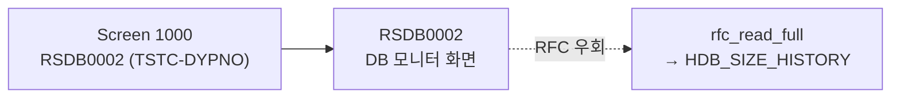

# DB02 분석 (A4H)
- 분석일: 2026-09-14, 대상 시스템: A4H (localhost trial, 001/DEVELOPER)
- 티코드: DB02 (Tables and Indexes Monitor. TSTCT 내역은 콘솔 인코딩 문제로 별도 확인 필요)
- 프로그램: RSDB0002 / DYPNO 1000 (TSTC live 실측)
- 탐색 방식: RFC live 실측 (`rfc_read_table` TSTC + `DDIF_FIELDINFO_GET` + `rfc_read_full` 스모크)

## 1. 실행 경로 요약 (5줄 이내)
1. `RSDB0002` (테이블/인덱스 모니터, 구 DB02 화면).
2. RFC 재현은 HANA 용량 테이블 직접 조회가 최단 경로.
3. `HDB_SIZE_HISTORY` 실존 (live 실측, 6필드: CON_NAME/COLLECT_DATE/MEMORY_USED/DISK_USED_DATA/DISK_USED_LOG/DISK_USED_TRACE).
4. `DB_SIZE_HISTORY_FOR_COCKPIT`는 A4H trial에 미존재 (`NOT_FOUND` live 실측) → F01에서 제외.
5. 테이블별 상세(F03)는 trial 미지원 → `NotImplementedError`.

## 2. 기능 카탈로그
| 기능ID | 기능명 | 원천 | RFC 재현 | 비고 |
|---|---|---|---|---|
| F01 | HANA 용량 최신 스냅샷 | HDB_SIZE_HISTORY (R, live 실측) | 가능 (`rfc_read_full` + CON_NAME별 최신행) | |
| F02 | HANA 용량 히스토리 조회 | HDB_SIZE_HISTORY (R, live 실측) | 가능 (`rfc_read_full` + 일자 WHERE) | |
| F03 | 테이블별 용량 TOP 조회 | trial 미지원 | 불가 + 사유 | 상세 테이블 미존재 |

## 2.5 화면요소-소스-펑션 연계도


## 3. 기능별 호출 인자
### F01 HANA 용량 최신 스냅샷
- 인자: 없음
- 출력: `{"rows": [...], "count": n}` (CON_NAME별 최신 COLLECT_DATE 1행)

### F02 HANA 용량 히스토리 조회
- 선택: `DATE_FROM` (DATS YYYYMMDD), `DATE_TO` (DATS YYYYMMDD), `ROWCOUNT` (기본 200)
- 출력: `{"rows": [...], "count": n}` (CON_NAME+COLLECT_DATE 정렬)

### F03 테이블별 용량 TOP 조회
- 상태: trial 미지원 (`NotImplementedError`).

## 4. 테이블 CRUD
| 테이블 | R/W | 핵심 필드 | KEY/WHERE | 근거 소스 |
|---|---|---|---|---|
| HDB_SIZE_HISTORY | R | CON_NAME, COLLECT_DATE, MEMORY_USED, DISK_USED_DATA, DISK_USED_LOG, DISK_USED_TRACE | CON_NAME+COLLECT_DATE | DDIF_FIELDINFO_GET live 실측 |
| DB_SIZE_HISTORY_FOR_COCKPIT | — | — | — | A4H trial 미존재 (NOT_FOUND live 실측) |

## 5. FM/BAPI 시그니처
| FM명 | Remote? | 요약 | 근거 |
|---|---|---|---|
| RFC_READ_TABLE | R | TABLENAME + FIELDS/OPTIONS/ROWCOUNT | 공용 래퍼 + live 스모크 |
| DDIF_FIELDINFO_GET | R | TABNAME → DFIES_TAB | live 실측 (HDB 6필드) |

## 6. 권한 체크
- live 스모크는 DEVELOPER(083 권한 유사)로 성공. 소스상 `AUTHORITY-CHECK`는 live ADT 조회 필요 — 미확인.

## 7. RFC-only 재현 전략 (sap-tcode-to-python 입력용)
- F01: `rfc_read_full` 전건 → CON_NAME별 최신행 (trial 데이터 소량이므로 메모리 처리).
- F02: 일자 WHERE + 정렬 + rowcount 절단.
- F03: 미지원 명시.

## 8. 원천 근거 로그 (복붙 가능)
```powershell
$env:SAP_PW_A4H = '...'
python smoke: get_connection_by_name("A4H") → CONNECT OK
rfc_read_table(conn,"TSTC",["TCODE","PGMNA","DYPNO"],where="TCODE = 'DB02'") → RSDB0002/1000
conn.call("DDIF_FIELDINFO_GET",TABNAME="HDB_SIZE_HISTORY") → 6필드
conn.call("DDIF_FIELDINFO_GET",TABNAME="DB_SIZE_HISTORY_FOR_COCKPIT") → NOT_FOUND
call_tool("F01"/"F02", conn) → OK (아래 검증 참조)
```

## 9. 미확인/주의사항
- TSTCT 내역(TTEXT) 미확인 (콘솔 cp949 문제, 기능 무관).
- 원천 프로그램 소스(ADT) 미정독 — 화면 경로 재현이 아닌 RFC 우회이므로 F01/F02 계약에는 영향 없음.
- F03은 실시스템(DBACOCKPIT 테이블 존재 환경)에서 재분석 필요.
