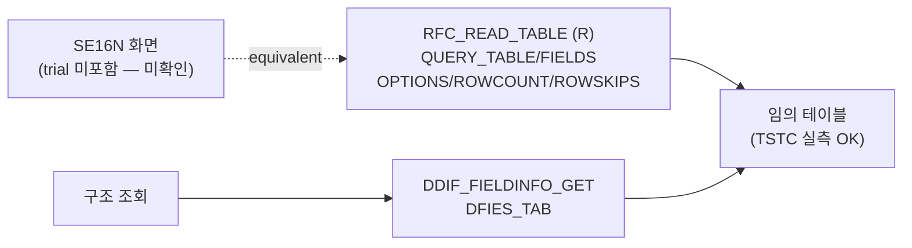

# SE16N 분석 (A4H)
- 분석일: 2026-09-09, 대상 시스템: A4H (localhost trial, 001/DEVELOPER)
- 티코드: SE16N — **TSTC/TSTCP/ADT 모두 미확인** (trial 미포함 추정, TSTC LIKE 'SE16%'에도 없음)
- 탐색 방식: erpl-adt CLI (= MCP adt_* 대응)

## 1. 실행 경로 요약 (5줄 이내)
1. SE16N 티코드 자체가 trial에 없음 → 프로그램 원천 미확정.
2. SE16N의 RFC 핵심은 `RFC_READ_TABLE` (테이블 내용 조회) + `DDIF_FIELDINFO_GET` (구조 조회) — 둘 다 R/실측.
3. 본 모듈은 SE16N equivalent (임의 테이블 조회/구조 조회)를 구현한다.
4. WHERE 72자 분할·페이징은 `sap_monthly_report` 래퍼가 처리.
5. 필요 권한: `S_TABU_NAM` (테이블 읽기), `S_RFC`.

## 2. 기능 카탈로그
| 기능ID | 기능명 | 원천 | RFC 재현 | 비고 |
|---|---|---|---|---|
| F01 | 테이블 내용 조회 | RFC_READ_TABLE (R) | 가능 | rowcount/rowskips 페이징 |
| F02 | 테이블 구조 조회 | DDIF_FIELDINFO_GET | 가능 | DFIES_TAB 반환 |

## 2.5 화면요소-소스-펑션 연계도


## 3. 기능별 호출 인자
### F01 테이블 내용 조회
- 필수: `TABLE`
- 선택: `FIELDS`(생략 시 전 필드 자동 조회), `WHERE`, `ROWCOUNT`(기본 100), `ROWSKIPS`(기본 0)
- 출력: `{"columns": [...], "rows": [{...}]}`
### F02 테이블 구조 조회
- 필수: `TABLE`
- 출력: `{"fields": [{FIELDNAME, DATATYPE, LENG, KEYFLAG}]}`

## 4. 테이블 CRUD
| 테이블 | R/W | 핵심 필드 | KEY/WHERE | 근거 |
|---|---|---|---|---|
| 임의 (예 TSTC) | R | 전 필드 | 호출자 지정 | RFC 실측 (TSTC 5건) |

## 5. FM/BAPI 시그니처
| FM명 | Remote? | 요약 | 근거 |
|---|---|---|---|
| RFC_READ_TABLE | R | QUERY_TABLE/DELIMITER/FIELDS/OPTIONS/ROWCOUNT/ROWSKIPS → DATA | TFDIR + 실호출 |
| DDIF_FIELDINFO_GET | (repo 기존 사용) | TABNAME → DFIES_TAB | 실호출 (USR02/SNAP/RFCDES/…) |

## 6. 권한 체크
- `S_TABU_NAM` (테이블 읽기 권한, 미확인 표기 — 실측 불가), `S_RFC`.

## 7. RFC-only 재현 전략
- F01/F02 모두 직접 RFC. 대량은 `rfc_read_full` 페이징.

## 8. 원천 근거 로그
```powershell
rfc_read_table(conn,"TSTC",["TCODE","PGMNA"],...)  # SE16N 불재 확인용 LIKE 'SE16%' 포함
erpl-adt --insecure search 'SE16N*' / 'RK_SE16N*' / '*SE16N*'  # 모두 0건
```

## 9. 미확인/주의사항
- SE16N 프로그램 원천: trial에 없어 미확인. 정식 시스템에서 `TSTC`/`adt_search`로 재확인 필요.
