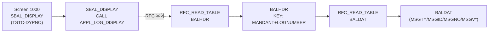

# SLG1 분석 (A4H)
- 분석일: 2026-09-09, 대상 시스템: A4H (localhost trial, 001/DEVELOPER)
- 티코드: SLG1 (Application Log: Display Logs, `TSTCT` E 실측)
- 프로그램: SBAL_DISPLAY / DYPNO 1000 (TSTC 실측, 1KB → `CALL FUNCTION 'APPL_LOG_DISPLAY'` 단일 호출 실측)
- 탐색 방식: erpl-adt CLI (= MCP adt_* 대응)

## 1. 실행 경로 요약 (5줄 이내)
1. `SBAL_DISPLAY`는 `APPL_LOG_DISPLAY` 호출 래퍼.
2. `BAL_DB_SEARCH`/`BAL_DB_LOAD`는 RFC 미지원(blank) 실측 → BAL FM 경로 불가.
3. RFC 재현은 `RFC_READ_TABLE(BALHDR/BALDAT)` 직접 조회. BALHDR KEY=MANTANT+LOGNUMBER(DFIES 44필드 실측), BALDAT 8필드 실측.
4. 필요 권한: `S_TABU_NAM`, `S_RFC`.

## 2. 기능 카탈로그
| 기능ID | 기능명 | 원천 | RFC 재현 | 비고 |
|---|---|---|---|---|
| F01 | 로그 헤더 검색 | RFC_READ_TABLE(BALHDR) | 가능 | OBJECT/SUBOBJECT/EXTNUMBER 필터 |
| F02 | 로그 메시지 조회 | BALDAT 직접 조회 시도 | 조건부 — AD718 시 GUI 전용 명시 | 클러스터 테이블 |

## 2.5 화면요소-소스-펑션 연계도


## 3. 기능별 호출 인자
### F01 로그 헤더 검색
- 선택: `OBJECT`, `SUBOBJECT`, `EXTNUMBER`, `MAX_ROWS`(기본 50)
- 출력: `{"logs": [{LOGNUMBER, OBJECT, SUBOBJECT, EXTNUMBER, ALDATE, ALTIME, ALUSER}]}`
### F02 로그 메시지 조회
- 필수: `LOGNUMBER` / 선택: `MAX_ROWS`(기본 200)
- 출력: `{"messages": [...]}`

## 4. 테이블 CRUD
| 테이블 | R/W | 핵심 필드 | KEY/WHERE | 근거 |
|---|---|---|---|---|
| BALHDR | R | LOGNUMBER/OBJECT/SUBOBJECT/EXTNUMBER/ALDATE/ALTIME/ALUSER | KEY MANDANT+LOGNUMBER | DFIES 44 실측 |
| BALDAT | R | MSGTY/MSGID/MSGNO/MSGV1-4 | LOGNUMBER | DFIES 8 실측 |

## 5. FM/BAPI 시그니처
| FM명 | Remote? | 요약 | 근거 |
|---|---|---|---|
| APPL_LOG_DISPLAY | (화면용) | SLG1 표시 진입점 | SBAL_DISPLAY 원문 |
| BAL_DB_SEARCH/LOAD | blank (미지원) | — | TFDIR |

## 6. 권한 체크
- 직접 확인분 없음 → 미확인. `S_TABU_NAM`, `S_RFC` 필요.

## 7. RFC-only 재현 전략
- F01/F02 테이블 직접 조회. BAL 포맷팅(치환 변수 해석)은 GUI 영역으로 원문 반환.

## 8. 원천 근거 로그
```powershell
rfc_read_table(conn,"TSTC",["TCODE","PGMNA","DYPNO"],where="TCODE = 'SLG1'")
erpl-adt --insecure source read SBAL_DISPLAY --type PROG  # APPL_LOG_DISPLAY 실측
table_fields(conn,"BALHDR")  # 44 fields / table_fields(conn,"BALDAT")  # 8 fields
```

## 9. 미확인/주의사항
- BALDAT MSGTY 외 메시지 텍스트 치환 — GUI 포맷 영역.
