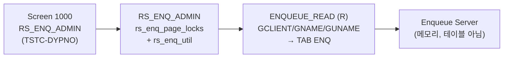

# SM12 분석 (A4H)
- 분석일: 2026-09-09, 대상 시스템: A4H (localhost trial, 001/DEVELOPER)
- 티코드: SM12 (Display and Delete Locks, `TSTCT` E 실측)
- 프로그램: RS_ENQ_ADMIN / DYPNO 1000 (TSTC 실측). include `rs_enq_util`, `rs_enq_page_locks` 등 (main 원문 실측)
- 탐색 방식: erpl-adt CLI (= MCP adt_* 대응)

## 1. 실행 경로 요약 (5줄 이내)
1. `RS_ENQ_ADMIN` (33KB) — 페이지(include) 구조의 lock monitor.
2. RFC 경로 `ENQUEUE_READ` (FMODE=R 실측). 시그니처 실측: IMP FAST/GARG/GARGNOWC/GCLIENT/GNAME/GUNAME/LOCAL, TAB ENQ.
3. 삭제는 GUI 전용 → RFC 재현은 조회만. 삭제 필요 시 `ENQUEUE_DELETE` 존재 여부 미확인.
4. 필요 권한: `S_RFC`, enqueue 읽기 권한 (미확인 표기).

## 2. 기능 카탈로그
| 기능ID | 기능명 | 원천 | RFC 재현 | 비고 |
|---|---|---|---|---|
| F01 | 락 목록 조회 | ENQUEUE_READ (R) | 가능 | GUNAME/GNAME/GCLIENT 필터 |

## 2.5 화면요소-소스-펑션 연계도


## 3. 기능별 호출 인자
### F01 락 목록 조회
- 선택: `USERNAME`(GUNAME), `TABLENAME`(GNAME), `CLIENT`(GCLIENT, 생략 시 전체)
- 출력: `{"locks": [...], "count": n}` (ENQ 행 원문)

## 4. 테이블 CRUD
| 테이블 | R/W | 비고 |
|---|---|---|
| (없음 — enqueue 서버 메모리) | — | RFC_READ_TABLE 대상 아님 |

## 5. FM/BAPI 시그니처
| FM명 | Remote? | 요약 | 근거 |
|---|---|---|---|
| ENQUEUE_READ | R | IMP FAST/GARG/GARGNOWC/GCLIENT/GNAME/GUNAME/LOCAL, TAB ENQ | get_function_description 실측 |

## 6. 권한 체크
- 소스 내 AUTHORITY-CHECK 직접 확인분 없음 → 미확인.

## 7. RFC-only 재현 전략
- F01 직접 호출. 락 삭제는 GUI 전용으로 미지원 (ENQUEUE_DELETE 미확인).

## 8. 원천 근거 로그
```powershell
rfc_read_table(conn,"TSTC",["TCODE","PGMNA","DYPNO"],where="TCODE = 'SM12'")
erpl-adt --insecure source read RS_ENQ_ADMIN --type PROG  # INCLUDE 실측
rfc_read_table(conn,"TFDIR",["FUNCNAME","FMODE"],where="FUNCNAME = 'ENQUEUE_READ'")
conn.get_function_description("ENQUEUE_READ")
```

## 9. 미확인/주의사항
- ENQUEUE_DELETE 존재 여부, SM12 삭제 기능의 RFC 대체 — 미확인.
