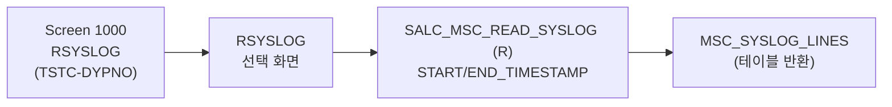

# SM21 분석 (A4H)
- 분석일: 2026-09-09, 대상 시스템: A4H (localhost trial, 001/DEVELOPER)
- 티코드: SM21 (system log, `TSTCT` E 실측)
- 프로그램: RSYSLOG / DYPNO 1000 (TSTC 실측, 12KB, DYNP_VALUES_READ/F4/RSP 실측)
- 탐색 방식: erpl-adt CLI (= MCP adt_* 대응)

## 1. 실행 경로 요약 (5줄 이내)
1. `RSYSLOG` 선택 화면 → syslog 읽기 → ALV 표시.
2. RFC 경로 `SALC_MSC_READ_SYSLOG` (FMODE=R 실측). 시그니처 실측: IMP END_TIMESTAMP/MANDT/ONLY_LOCAL/READ_RSAU_INSTEAD/START_TIMESTAMP/TIDNUM_TO_START/USERID, TAB MSC_SYSLOG_LINES/TID/TIDRC.
3. 후보 `RZL_READ_SYSLOG(_DIR)`는 미존재. `/SDF/SYSLOG_EXTRACTOR`(R) 대체 가능.
4. 필요 권한: `S_RFC`.

## 2. 기능 카탈로그
| 기능ID | 기능명 | 원천 | RFC 재현 | 비고 |
|---|---|---|---|---|
| F01 | 시스템 로그 조회 | SALC_MSC_READ_SYSLOG (R) | 가능 | 시간 범위 + 행수 절단 |

## 2.5 화면요소-소스-펑션 연계도


## 3. 기능별 호출 인자
### F01 시스템 로그 조회
- 선택: `START_TIMESTAMP`/`END_TIMESTAMP`(YYYYMMDDHHMMSS), `MAX_LINES`(기본 200, 모듈 내 절단)
- 출력: `{"lines": [...], "count": n}`

## 4. 테이블 CRUD
| 테이블 | R/W | 비고 |
|---|---|---|
| (없음 — syslog 파일 기반, FM 경유) | — | |

## 5. FM/BAPI 시그니처
| FM명 | Remote? | 요약 | 근거 |
|---|---|---|---|
| SALC_MSC_READ_SYSLOG | R | IMP 시간범위 7종, TAB MSC_SYSLOG_LINES/TID/TIDRC | get_function_description 실측 |

## 6. 권한 체크
- 소스 내 AUTHORITY-CHECK 직접 확인분 없음 → 미확인.

## 7. RFC-only 재현 전략
- F01 직접 호출. 대량은 시간 범위 분할.

## 8. 원천 근거 로그
```powershell
rfc_read_table(conn,"TSTC",["TCODE","PGMNA","DYPNO"],where="TCODE = 'SM21'")
erpl-adt --insecure source read RSYSLOG --type PROG
rfc_read_table(conn,"TFDIR",["FUNCNAME","FMODE"],where="FUNCNAME LIKE '%SYSLOG%'")
conn.get_function_description("SALC_MSC_READ_SYSLOG")
```

## 9. 미확인/주의사항
- RZL_READ_SYSLOG 계열은 본 릴리스에 없음.
