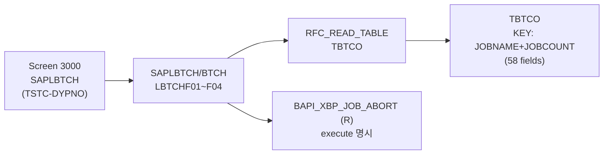

# SM37 분석 (A4H)
- 분석일: 2026-09-09, 대상 시스템: A4H (localhost trial, 001/DEVELOPER)
- 티코드: SM37 (Overview of job selection, `TSTCT` E 실측)
- 프로그램: SAPLBTCH / 그룹 BTCH (TSTC 실측, DYPNO 3000. 그룹 main 원문: LBTCHTOP/UXX/F01~F04 실측)
- 탐색 방식: erpl-adt CLI (= MCP adt_* 대응)

## 1. 실행 경로 요약 (5줄 이내)
1. `SAPLBTCH` 그룹 (BTCH) — 잡 선택·스냅샷·서브밋 헬퍼 include.
2. RFC 경로: `BAPI_XBP_JOB_SELECT` 등 XBP 계열 (R 실측, SELECT 포함 25건 중 확인분).
3. TBTCO 직접 조회 병행 (DFIES 58필드, KEY JOBNAME+JOBCOUNT 실측).
4. 중단: `BAPI_XBP_JOB_ABORT` (R 실측) — execute 명시 플래그.
5. 필요 권한: `S_RFC`, `S_BTCH_JOB` (미확인 표기).

## 2. 기능 카탈로그
| 기능ID | 기능명 | 원천 | RFC 재현 | 비고 |
|---|---|---|---|---|
| F01 | 잡 목록 조회 | RFC_READ_TABLE(TBTCO) | 가능 | JOBNAME prefix 필터 |
| F02 | 잡 상세 조회 | RFC_READ_TABLE(TBTCO KEY) | 가능 | JOBNAME+JOBCOUNT |
| F03 | 잡 중단 | BAPI_XBP_JOB_ABORT (R) | 가능 (execute 명시) | 기본 dry-run |

## 2.5 화면요소-소스-펑션 연계도


## 3. 기능별 호출 인자
### F01 잡 목록 조회
- 선택: `JOBNAME`(prefix LIKE), `MAX_ROWS`(기본 50)
- 출력: `{"jobs": [{JOBNAME, JOBCOUNT, SDLSTRTDT, SDLSTRTTM, STATUS}]}`
### F02 잡 상세 조회
- 필수: `JOBNAME`, `JOBCOUNT`
- 출력: `{"job": {...}}` (핵심 8필드. SDLPRIO는 TBTCO에 없음 — 실측). 없으면 KeyError.
### F03 잡 중단
- 필수: `JOBNAME`, `JOBCOUNT` / 선택: `EXECUTE`(기본 False=dry-run)
- 출력: `{"aborted": bool}`

## 4. 테이블 CRUD
| 테이블 | R/W | 핵심 필드 | KEY/WHERE | 근거 |
|---|---|---|---|---|
| TBTCO | R | JOBNAME/JOBCOUNT/SDLSTRTDT/SDLSTRTTM/STATUS | KEY JOBNAME+JOBCOUNT | DFIES 58 실측 |

## 5. FM/BAPI 시그니처
| FM명 | Remote? | 요약 | 근거 |
|---|---|---|---|
| BAPI_XBP_JOB_SELECT | R | JOB_SELECT_PARAM 등 → SELECTED_JOBS | TFDIR |
| BAPI_XBP_JOB_ABORT | R | JOBNAME/JOBCOUNT → 중단 | TFDIR |
| BAPI_XBP_JOB_CLOSE/OPEN 등 | R | 잡 생성계 | TFDIR LIKE 실측 |

## 6. 권한 체크
- 직접 확인분 없음 → 미확인. `S_BTCH_JOB`, `S_RFC` 필요.

## 7. RFC-only 재현 전략
- F01/F02 TBTCO 직접 조회. F03은 execute 명시 시만 실호출.

## 8. 원천 근거 로그
```powershell
rfc_read_table(conn,"TSTC",["TCODE","PGMNA","DYPNO"],where="TCODE = 'SM37'")
erpl-adt --insecure source read /sap/bc/adt/functions/groups/btch/source/main
rfc_read_table(conn,"TFDIR",["FUNCNAME","FMODE"],where="FUNCNAME LIKE 'BAPI_XBP_JOB%'")
table_fields(conn,"TBTCO")  # 58 fields, keys 실측
```

## 9. 미확인/주의사항
- BAPI_XBP_JOB_SELECT 상세 파라미터 실호출 테스트 — XBP 변형(variant) 요구 가능, TBTCO 경로 우선.
