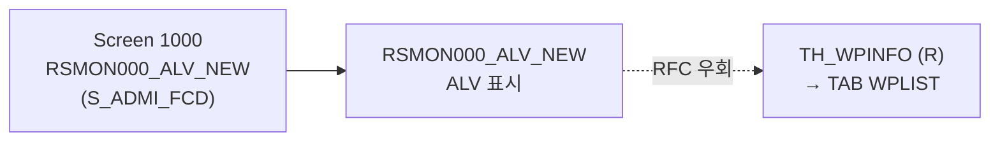

# SM50 분석 (A4H)
- 분석일: 2026-09-09, 대상 시스템: A4H (localhost trial, 001/DEVELOPER)
- 티코드: SM50 (Work Processes of AS Instance, `TSTCT` E 실측)
- 프로그램: RSMON000_ALV_NEW / DYPNO 1000 (TSTC 실측, 280KB. `AUTHORITY_CHECK_TCODE` + AUTH `S_ADMI_FCD` 원문 실측)
- 탐색 방식: erpl-adt CLI (= MCP adt_* 대응)

## 1. 실행 경로 요약 (5줄 이내)
1. `RSMON000_ALV_NEW` (ALV 그리드 표시) — S_ADMI_FCD 권한 체크 실측.
2. RFC 경로 `TH_WPINFO` (FMODE=R 실측). 시그니처 실측: IMP MAX_ELEMS/SRVNAME/WITH_CPU/WITH_MTX_INFO, TAB WPLIST.
3. 필요 권한: `S_ADMI_FCD` (실측), `S_RFC`.

## 2. 기능 카탈로그
| 기능ID | 기능명 | 원천 | RFC 재현 | 비고 |
|---|---|---|---|---|
| F01 | 워크 프로세스 목록 | TH_WPINFO (R) | 가능 | WITH_CPU 선택 |

## 2.5 화면요소-소스-펑션 연계도


## 3. 기능별 호출 인자
### F01 워크 프로세스 목록
- 선택: `WITH_CPU`('X')
- 출력: `{"wp": [...], "count": n}` (WPLIST 행 원문)

## 4. 테이블 CRUD
| 테이블 | R/W | 비고 |
|---|---|---|
| (없음 — 메모리 상태 FM 경유) | — | |

## 5. FM/BAPI 시그니처
| FM명 | Remote? | 요약 | 근거 |
|---|---|---|---|
| TH_WPINFO | R | IMP 4종, TAB WPLIST | get_function_description 실측 |

## 6. 권한 체크
- 실측: `AUTHORITY-CHECK OBJECT 'S_ADMI_FCD'` (RSMON000_ALV_NEW 원문).

## 7. RFC-only 재현 전략
- F01 직접 호출.

## 8. 원천 근거 로그
```powershell
rfc_read_table(conn,"TSTC",["TCODE","PGMNA","DYPNO"],where="TCODE = 'SM50'")
erpl-adt --insecure source read RSMON000_ALV_NEW --type PROG  # AUTHORITY_CHECK/S_ADMI_FCD 실측
conn.get_function_description("TH_WPINFO")
```

## 9. 미확인/주의사항
- 없음 (핵심 경로 전부 실측).
