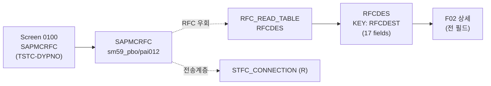

# SM59 분석 (A4H)
- 분석일: 2026-09-09, 대상 시스템: A4H (localhost trial, 001/DEVELOPER)
- 티코드: SM59 (RFC Destinations (Display/Edit), `TSTCT` E 실측)
- 프로그램: SAPMCRFC / 모듈풀 / DYPNO 0100 (TSTC 실측, include sm59_top2/climpl2/pbo012/pai012/forms2 실측)
- 탐색 방식: erpl-adt CLI (= MCP adt_* 대응)

## 1. 실행 경로 요약 (5줄 이내)
1. `SAPMCRFC` 모듈풀 (PBO/PAI include) — dynpro 기반 편집기.
2. 원천 테이블 `RFCDES` (DFIES 17필드 실측, KEY RFCDEST).
3. RFC 재현: `RFC_READ_TABLE(RFCDES)` 목록/상세 + `STFC_CONNECTION` 전송계층 테스트.
4. 대상별 연결 테스트·생성·변경은 GUI 전용.
5. 필요 권한: `S_TABU_NAM`, `S_RFC`, `S_RFCACL` (대상 테스트 시, 미확인 표기).

## 2. 기능 카탈로그
| 기능ID | 기능명 | 원천 | RFC 재현 | 비고 |
|---|---|---|---|---|
| F01 | 목적지 목록 | RFC_READ_TABLE(RFCDES) | 가능 | RFCTYPE 필터 |
| F02 | 목적지 상세 | RFC_READ_TABLE(RFCDES 부분집합) | 가능 | 전행 512자 초과 → 3필드 |
| F03 | 연결 테스트 | STFC_CONNECTION (R) | 부분 (전송계층) | 대상별 테스트는 GUI 전용 |

## 2.5 화면요소-소스-펑션 연계도


## 3. 기능별 호출 인자
### F01 목적지 목록
- 선택: `RFCTYPE`(예 '3'=ABAP), `MAX_ROWS`(기본 100)
- 출력: `{"destinations": [{RFCDEST, RFCTYPE, RFCOPTIONS}]}`
### F02 목적지 상세
- 필수: `RFCDEST`
- 출력: `{"destination": {...}}` (전 필드). 없으면 KeyError.
### F03 연결 테스트
- 인자 없음. 출력: `{"ok": True, "echotext": ..., "responsetext": ...}`

## 4. 테이블 CRUD
| 테이블 | R/W | 핵심 필드 | KEY/WHERE | 근거 |
|---|---|---|---|---|
| RFCDES | R | RFCDEST/RFCTYPE/RFCOPTIONS 외 14 | KEY RFCDEST | DFIES 17 실측 |

## 5. FM/BAPI 시그니처
| FM명 | Remote? | 요약 | 근거 |
|---|---|---|---|
| STFC_CONNECTION | R | REQUTEXT → ECHOTEXT/RESPTEXT | TFDIR + 실호출 |

## 6. 권한 체크
- 직접 확인분 없음 → 미확인.

## 7. RFC-only 재현 전략
- F01/F02 테이블 직접 조회. 생성·변경·대상별 테스트는 GUI 전용.

## 8. 원천 근거 로그
```powershell
rfc_read_table(conn,"TSTC",["TCODE","PGMNA","DYPNO"],where="TCODE = 'SM59'")
erpl-adt --insecure source read /sap/bc/adt/programs/programs/sapmcrfc/source/main  # include 실측
table_fields(conn,"RFCDES")  # 17 fields, KEY RFCDEST
```

## 9. 미확인/주의사항
- RFCDES 생성·변경용 RFC (RC/BC FM) — 미확인, GUI 전용으로 분류.
