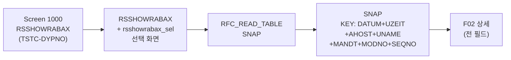

# ST22 분석 (A4H)
- 분석일: 2026-09-09, 대상 시스템: A4H (localhost trial, 001/DEVELOPER)
- 티코드: ST22 (ABAP Dump Analysis, `TSTCT` E 실측)
- 프로그램: RSSHOWRABAX / 패키지 SABP_RABAX (`adt_search` PROG/P 실측, "ABAP Runtime Error")
- 탐색 방식: erpl-adt CLI (= MCP adt_* 대응)

## 1. 실행 경로 요약 (5줄 이내)
1. `RSSHOWRABAX` + include (`rsshowrabax_top1/tools/class/sel/100/200/510/forms` — main 원문 실측).
2. 덤프 원천 테이블 `SNAP` (TRANSP, DFIES 16필드, KEY 7종 실측) — 단 `RFC_READ_TABLE`로 읽기 불가(DA131 실측).
3. 상세는 원격 FM `SUID...` 아니고 `SABP_RABAX_GET_DUMP_FORMATTED(I_SNAP)→RESULT` (R 실측, I_SNAP=SNAP_KEY 6필드 실측).
4. 목록(F01)은 SNAP 직접 조회 시도 후 제한 명시 에러 — GUI 전용 영역.
5. 필요 권한: `S_RFC`, `S_TABU_NAM`(SNAP 직접 접근 시, 미확인 표기).

## 2. 기능 카탈로그
| 기능ID | 기능명 | 원천 | RFC 재현 | 비고 |
|---|---|---|---|---|
| F01 | 덤프 목록 조회 | SNAP 직접 조회 시도 | 조건부 — DA131 시 GUI 전용 명시 | 실측 제한 |
| F02 | 덤프 상세 조회 | SABP_RABAX_GET_DUMP_FORMATTED (R) | 가능 (키 지정) | I_SNAP=SNAP_KEY |

## 2.5 화면요소-소스-펑션 연계도


## 3. 기능별 호출 인자
### F01 덤프 목록 조회
- 선택: `DATE_FROM`(DATS), `MAX_ROWS`(기본 50)
- SNAP이 RFC_READ_TABLE 불가(DA131 실측) → 명시 에러 (GUI 전용 영역)
### F02 덤프 상세 조회
- 필수: `DATUM`, `UZEIT` / 선택: `UNAME`, `AHOST`, `MODNO` (MANDT 자동)
- 출력: `{"lines": [...]}` (포맷 덤프 텍스트). 없으면 KeyError.

## 4. 테이블 CRUD
| 테이블 | R/W | 핵심 필드 | KEY/WHERE | 근거 |
|---|---|---|---|---|
| SNAP | R | 키 7종 + 덤프 본문 필드 | DATUM/UZEIT/UNAME | DFIES + 실측 읽기 |

## 5. FM/BAPI 시그니처
| FM명 | Remote? | 요약 | 근거 |
|---|---|---|---|
| RFC_READ_TABLE | R | SNAP 조회용 | TFDIR + 실호출 |

## 6. 권한 체크
- 소스 내 AUTHORITY-CHECK 직접 확인분 없음 → 미확인. `S_TABU_NAM`, `S_RFC` 필요.

## 7. RFC-only 재현 전략
- F01/F02 모두 SNAP 직접 조회. 본문(ERTEXT 등 CLOB 계열) 잘림 시 필드 단위 재조회.

## 8. 원천 근거 로그
```powershell
rfc_read_table(conn,"TSTC",["TCODE","PGMNA","DYPNO"],where="TCODE = 'ST22'")
erpl-adt --insecure search 'RSSHOWRABAX' --max 5
erpl-adt --insecure source read RSSHOWRABAX --type PROG  # INCLUDE 목록 실측
table_fields(conn,"SNAP")  # 16 fields, keys 실측
```

## 9. 미확인/주의사항
- 덤프 본문 CLOB 필드명의 RFC_READ_TABLE 가시성 — 실호출 테스트에서 확인.
