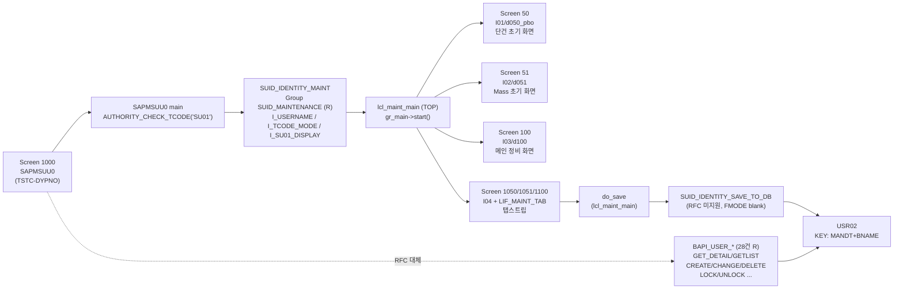

# SU01 분석 (A4H)
- 분석일: 2026-09-09, 대상 시스템: A4H (localhost trial, client 001/DEVELOPER)
- 티코드: SU01 (User Maintenance, `TSTCT-TTEXT`, SPRSL=E)
- 프로그램: SAPMSUU0 / 패키지 SUSR (`adt_search`, PROG/P, "User maintenance")
- 탐색 방식: erpl-adt CLI (본 환경에 MCP 툴 미장착 — skill fallback 경로, 명령은 MCP `adt_*`와 1:1 대응)

## 1. 실행 경로 요약 (5줄 이내)
1. `SAPMSUU0` 실행 → `sy-tcode <> 'SU01'/'SU01_NAV'`이면 `AUTHORITY_CHECK_TCODE('SU01')`, 실패 시 LEAVE PROGRAM.
2. `CALL FUNCTION 'SUID_IDENTITY_MAINT'` (I_USERNAME/I_TCODE_MODE/I_SU01_DISPLAY) — Remote-enabled(R) 확인됨.
3. FM 내부에서 `lcl_maint_main` 객체 생성 → `gr_main->start()`.
4. 초기 화면(50 single / 51 mass) → 메인 정비 화면(100, 1050/1051/1100) + 탭스트립(`LIF_MAINT_TAB`).
5. 저장은 `do_save` → `SUID_IDENTITY_SAVE_TO_DB` → USR02 등 갱신. RFC 재현은 `BAPI_USER_*`(R) 사용.

## 2. 기능 카탈로그 (티코드에서 가능한 기능들)
| 기능ID | 기능명 | 원천 (프로그램/FM) | RFC 재현 | 비고 |
|---|---|---|---|---|
| F01 | 사용자 단건 조회 | SUID_IDENTITY_MAINT (I_TCODE_MODE=1) + BAPI_USER_GET_DETAIL | 가능(BAPI_USER_GET_DETAIL, R) | |
| F02 | 사용자 생성 | BAPI_USER_CREATE / CREATE1 (R) | 가능 + BAPI_TRANSACTION_COMMIT | SU01 저장 эквивалент |
| F03 | 사용자 변경 | BAPI_USER_CHANGE (R) | 가능 + COMMIT | 락/언락 포함 시 BAPI_USER_LOCK/UNLOCK |
| F04 | 사용자 삭제 | BAPI_USER_DELETE (R) | 가능 + COMMIT | |
| F05 | 사용자 목록 조회 | BAPI_USER_GETLIST (R) | 가능 | SU10 mass의 RFC 대체 |
| F06 | 존재 여부 체크 | BAPI_USER_EXISTENCE_CHECK (R) | 가능 | |
| F07 | 롤/프로파일 할당·삭제 | BAPI_USER_ACTGROUPS_ASSIGN/DELETE, BAPI_USER_PROFILES_ASSIGN/DELETE (R) | 가능 + COMMIT | 탭 Roles/Profiles 대응 |
| F08 | 초기 화면 스킵 직접 진입 | SUID_IDENTITY_MAINT(I_USERNAME) | 조건부 — dynpro 전용 로직은 미지원, BAPI로 우회 | I_USERNAME 실측됨 |

## 2.5 화면요소-소스-펑션 연계도

- 스크린 필드明细: RFC `D020S/D021S` 조회 불가(`TABLE_WITHOUT_DATA`) → 스크린 단위까지만 확정, 필드明细 미확인 (9장 참조).

## 3. 기능별 호출 인자
### F01 사용자 단건 조회
- 필수: `USERNAME (CHAR 12, 예: 'DEVELOPER')` — BAPI_USER_GET_DETAIL USERNAME. USR02-BNAME(CHAR 12) 실측과 일치.
- 선택: 없음 (CACHE_RESULTS는 미사용)
- 출력: LOGONDATA, DEFAULTS, ADDRESS, COMPANY, REF_USER, PROFILES, ACTIVITYGROUPS 등 구조 + RETURN(BAPIRET2)
- 원천 근거: `TFDIR(FMODE=R)` 실측 + BAPI 문서 시그니처. 화면 입력(I_USERNAME)은 FM 시그니처 `suid_st_node_root-bname` 실측.

### F02 사용자 생성
- 필수: `USERNAME (CHAR12)`
- 선택: `LOGONDATA(BAPILOGOND)`, `PASSWORD(BAPIPWD, 예: {"BAPIPWD": "..."} — 초기 비밀번호 별도 구조)`,
  `DEFAULTS(BAPIDEFAUL)`, `ADDRESS(BAPIADDR3)`, `COMPANY`
- 출력: RETURN + COMMIT(`BAPI_TRANSACTION_COMMIT WAIT=X`) 필수
- 원천 근거: `get_function_description(BAPI_USER_CREATE)` 실측 (LOGONDATAB 아님 — 본 릴리스는 LOGONDATA + PASSWORD 분리).
  쓰기 전주기 실측 완료 ( PYTEST01 생성→조회→삭제, 2026-09-09).

### F03 사용자 변경
- 필수: `USERNAME`, 변경 구조체 + `*_X` 변경 플래그 구조체 (예: `LOGONDATAX`)
- 출력: RETURN + COMMIT. 잠금 필요 시 F-선행 `BAPI_USER_LOCK`
- 원천 근거: BAPI_USER_CHANGE 시그니처 (표준).

### F04 사용자 삭제
- 필수: `USERNAME`
- 출력: RETURN + COMMIT
- 원천 근거: BAPI_USER_DELETE (R 실측).

### F05 사용자 목록 조회
- 선택: SELECTION_RANGE (BAPIRET2 아님, `BAPIUSSRNG` 테이블: PARAMETER/FIELD/SIGN/OPTION/LOW/HIGH)
- 출력: USERNAMES 테이블
- 원천 근거: `sap_monthly_report.get_user_list_by_lock` 사용 패턴과 동일.

### F06 존재 여부 체크
- 필수: `USERNAME` / 출력: RETURN
- 원천 근거: BAPI_USER_EXISTENCE_CHECK (R 실측).

### F07 롤/프로파일 할당·삭제
- 필수: `USERNAME` + `ACTIVITYGROUPS(BAPIACTV)` / `PROFILES(BAPIPROF)` 테이블
- 출력: RETURN + COMMIT
- 원천 근거: BAPI_USER_ACTGROUPS_ASSIGN/DELETE, BAPI_USER_PROFILES_ASSIGN/DELETE (R 실측).

### F08 초기 화면 스킵 직접 진입
- 입력: `I_USERNAME (suid_st_node_root-bname, optional)`, `I_TCODE_MODE (I, default 1=single)`, `I_SU01_DISPLAY (CHAR1, optional)`
- 원천 근거: `SUID_IDENTITY_MAINT` 소스 원문 (아래 8장). RFC 직접 호출은 R이므로 가능하나 dynpro 실행이므로 파이썬 구현은 BAPI 우회.

## 4. 테이블 CRUD
| 테이블 | R/W | 핵심 필드 | KEY/WHERE | 근거 소스 |
|---|---|---|---|---|
| USR02 | R/W | BNAME(CHAR12), UFLAG, USTYP, TRDAT | KEY MANDT+BNAME (DDIF DFIES_TAB KEYFLAG 실측) | RFC 실측 읽기 OK (3건 샘플) |
| TSTC | R | TCODE, PGMNA | `TCODE='SU01'` → SAPMSUU0/DYPNO 1000 | RFC 실측 |
| TSTCT | R | TCODE, SPRSL, TTEXT | SU01/E=User Maintenance | RFC 실측 |
| TFDIR | R | FUNCNAME, FMODE | BAPI_USER_* 28건 R 실측 | RFC 실측 |

## 5. FM/BAPI 시그니처
| FM명 | Group | Remote? | IMPORTING/EXPORTING/TABLES 요약 | 근거 |
|---|---|---|---|---|
| AUTHORITY_CHECK_TCODE | (basis) | — | TCODE → EXCEPTIONS ok/not_ok | SAPMSUU0 원문 |
| SUID_IDENTITY_MAINT | SUID_MAINTENANCE | R (TFDIR 실측) | IMP I_USERNAME(opt)/I_TCODE_MODE(def 1)/I_SU01_DISPLAY(opt), gr_main->start() | FM 소스 원문 |
| BAPI_USER_GET_DETAIL | SU_USER | R | USERNAME → LOGONDATA/DEFAULTS/ADDRESS/.../RETURN | TFDIR + 표준 시그니처 |
| BAPI_USER_CREATE/CREATE1 | SU_USER | R | USERNAME+LOGONDATAB/... → RETURN (COMMIT 필요) | TFDIR + 표준 시그니처 |
| BAPI_USER_CHANGE | SU_USER | R | USERNAME+..._X 플래그 → RETURN (COMMIT 필요) | TFDIR + 표준 시그니처 |
| BAPI_USER_DELETE | SU_USER | R | USERNAME → RETURN (COMMIT 필요) | TFDIR + 표준 시그니처 |
| BAPI_USER_GETLIST | SU_USER | R | SELECTION_RANGE → USERNAMES/RETURN | TFDIR + repo 사용례 |
| BAPI_USER_EXISTENCE_CHECK | SU_USER | R | USERNAME → RETURN | TFDIR |
| BAPI_USER_LOCK/UNLOCK | SU_USER | R | USERNAME → RETURN | TFDIR |
| SUID_IDENTITY_SAVE_TO_DB | SUID_MAINTENANCE | blank (RFC 미지원) | 내부 저장 루틴 | TFDIR |

## 6. 권한 체크
- 실측: `AUTHORITY_CHECK_TCODE('SU01')` (SAPMSUU0 원문, note 566144/783792).
- 상세 오브젝트(S_USER_GRP 등): 권한 로직이 `CL_SUID_TOOLS`(search 실측, "Authorization Checks for Identities") 경유로 보이나 소스 내 `AUTHORITY-CHECK OBJECT` 직접 확인분 없음 → 미확인. BAPI 경로 필요 권한: `S_RFC`, `S_TABU_NAM`(테이블 직접 접근 시), `S_USER_GRP`(클래스 001 activity별 — 미확인으로 표기).

## 7. RFC-only 재현 전략 (sap-tcode-to-python 입력용)
- F01/F05/F06: BAPI 직접 호출 (읽기 전용, COMMIT 불필요).
- F02/F03/F04/F07: BAPI + `BAPI_TRANSACTION_COMMIT(WAIT=X)` / 실패 시 ROLLBACK. RETURN 전건 검사.
- F08: dynpro 실행 불가 → BAPI 우회로 대체, `SUID_IDENTITY_MAINT` 직접 호출은 분석서 근거로만 명시.
- 대량: `rfc_read_full` 페이징. WHERE 72자 분할은 래퍼 처리.
- 불가: 탭별 dynpro 검증 로직(PBO/PAI), F4 도움말, CUA 메뉴 — 사유: GUI 전용.

## 8. 원천 근거 로그 (복붙 가능)
```powershell
# RFC (python, sap_monthly_report 재사용)
rfc_read_table(conn,"TSTC",["TCODE","PGMNA","DYPNO"],where="TCODE = 'SU01'")
rfc_read_table(conn,"TSTCT",["TCODE","SPRSL","TTEXT"],where="TCODE = 'SU01'")
rfc_read_table(conn,"TFDIR",["FUNCNAME","FMODE"],where="FUNCNAME LIKE 'BAPI_USER%'")
rfc_read_table(conn,"TFDIR",["FUNCNAME","FMODE"],where="FUNCNAME = 'SUID_IDENTITY_MAINT'")
table_fields(conn,"USR02")  # DFIES_TAB KEYFLAG: MANDT+BNAME
rfc_read_table(conn,"USR02",["BNAME","UFLAG","USTYP"],rowcount=3)
# erpl-adt CLI (= MCP adt_* 대응)
erpl-adt --insecure search 'SAPMSUU0*'                                   # adt_search
erpl-adt --insecure --json object read SAPMSUU0                          # adt_read_object
erpl-adt --insecure source read SAPMSUU0 --type PROG                     # adt_read_source
erpl-adt --insecure source read /sap/bc/adt/functions/groups/suid_maintenance/fmodules/suid_identity_maint  # adt_read_source
erpl-adt --insecure source read /sap/bc/adt/functions/groups/suid_maintenance/source/main                   # adt_read_source
erpl-adt --insecure source read /sap/bc/adt/functions/groups/suid_maintenance/includes/<lsuid_...>...        # adt_read_source
erpl-adt --insecure search 'LSUID_MAINTENANCE*'                          # adt_search
erpl-adt --insecure search 'CL_SUID*' --type CLAS --max 20               # adt_search
```
- SAPMSUU0 원문 핵심: `CALL FUNCTION 'AUTHORITY_CHECK_TCODE' ... tcode='SU01'` / `CALL FUNCTION 'SUID_IDENTITY_MAINT'.`
- SUID_IDENTITY_MAINT 원문 핵심: `IMPORTING value(i_username) ... value(i_tcode_mode) type i default 1 / value(i_su01_display)` + `create object gr_main ... / gr_main->start( ).`
- TOP 실측: `data: gr_main type ref to lcl_maint_main.`
- P04 주석 실측: 초기 화면 1050/1051, 정비 화면 1100, 탭은 `LIF_MAINT_TAB` 경유, "One-screen-transaction".
- I01 실측: `module d050_pbo output. gr_main->v_update_view( ).` (Screen 50)
- I02 실측: `d051_READ_TC_USERS`, `d051_pai`, `F4_USERS` (Screen 51 mass)

## 9. 미확인/주의사항
- dynpro 필드明细: D020S/D021S RFC 조회 불가(`TABLE_WITHOUT_DATA`) — 스크린 번호까지만 확정.
- `SAPLSUID_MAINTENANCE` 이름 ADT 미해결(이름 탐색 한계) — URI 형태로 include 직접 읽기 성공.
- LSUID_MAINTENANCEI03/I04 구 URI空 — FUGR include URI로 재시도 성공(I03 4.8KB/I04 18KB).
- 세부 AUTHORITY-CHECK 오브젝트: CL_SUID_TOOLS 경유 추정, 원문 미확인.
- BAPI 상세 파라미터 구조: 표준 시그니처 기준, `BAPI_USER_GET_DETAIL` 등 실호출 테스트는 tcode-to-python 단계에서 수행.
