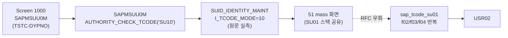

# SU10 분석 (A4H)
- 분석일: 2026-09-09, 대상 시스템: A4H (localhost trial, 001/DEVELOPER)
- 티코드: SU10 (User Mass Maintenance, `TSTCT` E 실측)
- 프로그램: SAPMSUU0M (TSTC 실측, DYPNO 1000. SU01 래퍼와 동일 구조).
- 탐색 방식: erpl-adt CLI (= MCP adt_* 대응)

## 1. 실행 경로 요약 (5줄 이내)
1. `SAPMSUU0M` → `sy-tcode <> 'SU10'`이면 `AUTHORITY_CHECK_TCODE('SU10')` (SU01 note 566144/783792 동일 패턴, 원문 실측).
2. `CALL FUNCTION 'SUID_IDENTITY_MAINT' EXPORTING i_tcode_mode = 10.` (mass, 원문 실측).
3. 이후 SU01과 동일 스택 (`lcl_maint_main`, 화면 51 mass 초기).
4. RFC 재현: `sap_tcode_su01` BAPI 함수를 행 반복 호출하는 대량 래퍼.
5. 필요 권한: SU01과 동일 (`S_RFC`, `S_TABU_NAM`, `S_USER_GRP` 미확인 표기).

## 2. 기능 카탈로그
| 기능ID | 기능명 | 원천 | RFC 재현 | 비고 |
|---|---|---|---|---|
| F01 | 대량 생성 | BAPI_USER_CREATE 반복 | 가능 (ok/failed 집계) | commit 공통 옵션 |
| F02 | 대량 변경 | BAPI_USER_CHANGE 반복 | 가능 | 변경 구조체 공통 |
| F03 | 대량 삭제 | BAPI_USER_DELETE 반복 | 가능 | commit 공통 옵션 |

## 2.5 화면요소-소스-펑션 연계도


## 3. 기능별 호출 인자
### F01 대량 생성
- 필수: `USERS`(USERNAME 리스트)
- 선택: `LOGONDATA`/`PASSWORD`(공통), `COMMIT`(기본 False)
- 출력: `{"ok": [...], "failed": [{user, error}], "ok_count": n, "fail_count": n}`
### F02 대량 변경
- 필수: `USERS` / 선택: 변경 구조체 키워드 + `COMMIT`
- 출력: F01과 동일 형식
### F03 대량 삭제
- 필수: `USERS` / 선택: `COMMIT`
- 출력: F01과 동일 형식

## 4. 테이블 CRUD
- SU01과 동일 (USR02).

## 5. FM/BAPI 시그니처
- SU01과 동일. 진입 FM `SUID_IDENTITY_MAINT` (R 실측).

## 6. 권한 체크
- 실측: `AUTHORITY_CHECK_TCODE('SU10')`.

## 7. RFC-only 재현 전략
- su01 함수 재사용 + 행 반복. 대량 실패는 중단 없이 집계.

## 8. 원천 근거 로그
```powershell
rfc_read_table(conn,"TSTC",["TCODE","PGMNA","DYPNO"],where="TCODE = 'SU10'")
erpl-adt --insecure source read /sap/bc/adt/programs/programs/sapmsuu0m/source/main  # i_tcode_mode=10 실측
```

## 9. 미확인/주의사항
- 없음 (핵심 경로 전부 실측).
